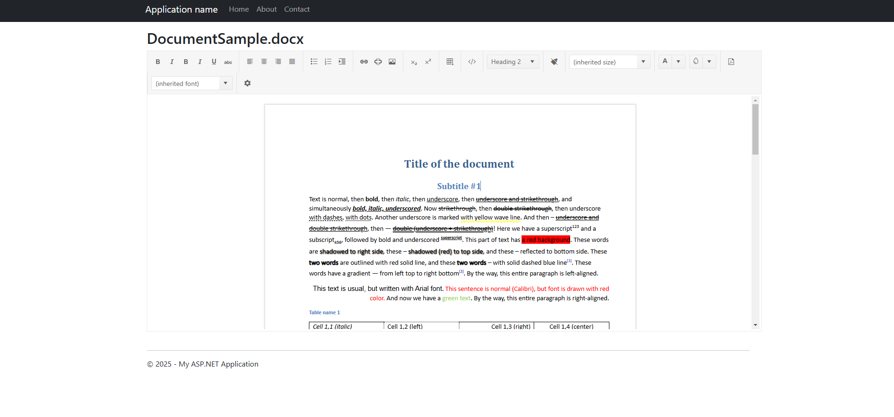

# GroupDocs.Editor and Kendo WYSIWYG Editor Integration Demo

This project demonstrates the integration of **GroupDocs.Editor** with the **Kendo WYSIWYG Editor** in an ASP.NET MVC application targeting **.NET Framework 4.6.2**. The application showcases how to load a Word document, render it as editable HTML, and allow users to modify the document in the Kendo WYSIWYG Editor.

---

## Features

- **Document Editing**: Load Word documents and display them in the Kendo Editor as editable HTML.
- **Rich Text Editing Tools**: Leverage Kendo's robust WYSIWYG editor features, including formatting, inserting images, creating tables, and more.
- **Custom Styling**: Define custom fonts, colors, and layouts for the editor.

*Coming soon:*
- **PDF Export**: Support for exporting content to PDF format via Kendo's PDF generation capabilities.
- **Save Functionality**: Save the modified content back to the server for further processing.

---

## Prerequisites

### Tools and Frameworks

- **Microsoft Visual Studio 2022 (or later)**
- **.NET Framework 4.6.2**
- **NuGet Package Manager**
- **GroupDocs.Editor 24.12.0** (or later)

### Required NuGet Packages

Install the following NuGet packages:
- **GroupDocs.Editor**
- **Microsoft.AspNet.Mvc**
- **Microsoft.AspNet.Razor**
- **Microsoft.AspNet.Web.Optimization**
- **Newtonsoft.Json**
- **jQuery**
- **Kendo UI (CDN Integration)**

---

## Project Structure

### Key Directories and Files

1. **Controllers**
   - `HomeController.cs`: Manages the logic for loading and rendering documents.

2. **Views**
   - **Home**
     - `Index.cshtml`: Displays the Kendo WYSIWYG editor with the loaded document content.
     - `About.cshtml`: Application description page.
     - `Contact.cshtml`: Contact information page.
   - **Shared**
     - `_Layout.cshtml`: Application layout file.
     - `Error.cshtml`: Displays error messages.

3. **Content**
   - Contains CSS files for styling, including Bootstrap and Kendo styles.

4. **Scripts**
   - JavaScript files for Kendo Editor initialization and custom functionalities.

---

## How It Works

1. **Document Loading**
   - The `HomeController` loads a Word document using the **GroupDocs.Editor API**.
   - The document is converted to editable HTML with embedded styles.

2. **Rendering in Kendo Editor**
   - The `Index.cshtml` view uses the Kendo Editor to display the HTML content.
   - The editor provides a rich text editing interface with tools for formatting, inserting elements, and managing layout.

3. **Saving Content** *(coming soon)*
   - Users can save the modified content back to the server using a `Save` button.
   - The content is sent via an AJAX POST request to a designated server endpoint.

---

## Setup Instructions

### 1. Clone or Download the Repository
Clone the repository to your local machine or download the ZIP file.

### 2. Configure NuGet Packages
Restore NuGet packages:
```bash
nuget restore
```

### 3. Add Sample Document
Place a sample Word document in the `Content` folder (e.g., `DocumentSample.docx`).

### 4. Run the Application
- Open the project in **Visual Studio**.
- Build and run the application.

---

## Usage

1. Navigate to the **Index** page.
2. Edit the loaded Word document using the Kendo Editor.
3. *(coming soon)* Click the **Save** button to save your changes.

---

## Dependencies

### GroupDocs.Editor
The **GroupDocs.Editor API** is used for converting documents to editable HTML. Learn more about it [here](https://products.groupdocs.com/editor).

### Kendo UI
The **Kendo WYSIWYG Editor** is utilized for providing a rich text editing experience. Learn more about it [here](https://www.telerik.com/kendo-ui).

---

## Screenshots

### Editor Interface


---

Empower your applications with GroupDocs.Editor for .NET and UI – your gateway to seamless document editing in the world of .NET development.


[Home](https://www.groupdocs.com/) | [Product Page](https://products.groupdocs.com/editor/net) | [Documentation](https://docs.groupdocs.com/editor/net/) | [Demo](https://products.groupdocs.app/editor/family) | [API Reference](https://apireference.groupdocs.com/editor/net) | [Examples](https://github.com/groupdocs-editor/GroupDocs.Editor-for-.NET) | [Blog](https://blog.groupdocs.com/category/editor/) | [Search](https://search.groupdocs.com/) | [Free Support](https://blog.groupdocs.com/category/editor/) | [Temporary License](https://purchase.groupdocs.com/temporary-license)