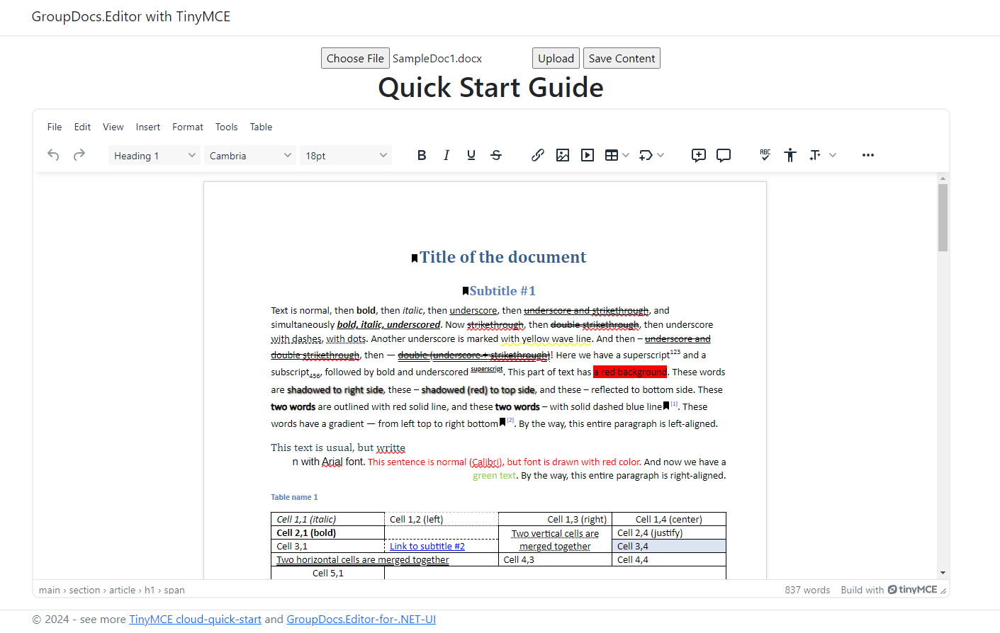

# Sample Project: GroupDocs.Editor with TinyMCE

This project demonstrates how to integrate GroupDocs.Editor with TinyMCE to create a user-friendly web-based document editor. The user interface (UI) is built using JQuery to configure TinyMCE and make API calls to the GroupDocs.Editor.UI.Api RESTful API web app via ASP.NET.


## Introduction
GroupDocs.Editor is a powerful document editing API that allows you to edit various document formats within your applications. This sample project integrates GroupDocs.Editor with the popular TinyMCE WYSIWYG editor, providing a seamless editing experience in a web application. The UI is designed using JQuery to handle TinyMCE configurations and communicate with the GroupDocs.Editor.UI.Api RESTful API web app.

## Supported Formats
WordProcessing Formats:

- **DOC**: MS Word 97-2007 Binary File Format
- **DOCX**: Office Open XML WordProcessingML Macro-Free Document
- **DOCM**: Office Open XML WordProcessingML Macro-Enabled Document
- **DOT**: MS Word 97-2007 Template
- **DOTX**: Office Open XML WordprocessingML Macro-Free Template
- **DOTM**: Office Open XML WordprocessingML Macro-Enabled Template
- **FlatOPC**: Office Open XML WordprocessingML stored in a flat XML file
- **ODT**: Open Document Format Text Document
- **OTT**: Open Document Format Text Document Template
- **RTF**: Rich Text Format
- **WordML**: Microsoft Office Word 2003 XML Format — WordProcessingML or WordML

## Setup and Installation

### Prerequisites
- Visual Studio 2019 or later
- .NET SDK installed
- GroupDocs.Editor for .NET library

### Backend Setup
The backend setup follows the sample provided [here](https://github.com/groupdocs-editor/GroupDocs.Editor-for-.NET-UI/tree/master/samples/GroupDocs.Editor.UI.RestFulApi). For more detailed instructions, refer to the [GroupDocs.Editor RESTful for .NET Wiki](https://github.com/groupdocs-editor/GroupDocs.Editor-for-.NET-UI/wiki/GroupDocs.Editor-RESTful-for-.Net).

1. Clone the repository:
   ```bash
   git clone https://github.com/groupdocs-editor/GroupDocs.Editor-for-.NET-UI.git
   ```
2. Navigate to the backend sample directory:
   ```bash
   cd GroupDocs.Editor-for-.NET-UI/samples/GroupDocs.Editor.UI.RestFulApi
   ```
3. Open the project in Visual Studio.
4. Restore NuGet packages:
   - Right-click on the solution in the Solution Explorer and select "Restore NuGet Packages."
5. Build the project:
   - Press `Ctrl+Shift+B` or select "Build Solution" from the "Build" menu.
6. Run the backend server:
   - Press `F5` or click the "Start" button in Visual Studio.

### Frontend Setup
The frontend is part of the ASP.NET MVC project, so no separate setup is needed for the frontend.

## Configuration

### TinyMCE Configuration
Configure TinyMCE in the `main.js` file located in the `Scripts` directory. Here is an example configuration:

```javascript
tinymce.init({
    selector: 'textarea',
    plugins: 'anchor autolink charmap codesample emoticons image link lists media searchreplace table visualblocks wordcount checklist mediaembed casechange export formatpainter pageembed linkchecker a11ychecker tinymcespellchecker permanentpen powerpaste advtable advcode editimage advtemplate ai mentions tinycomments tableofcontents footnotes mergetags autocorrect typography inlinecss markdown',
    toolbar: 'undo redo | blocks fontfamily fontsize | bold italic underline strikethrough | link image media table mergetags | addcomment showcomments | spellcheckdialog a11ycheck typography | align lineheight | checklist numlist bullist indent outdent | emoticons charmap | removeformat',
    tinycomments_mode: 'embedded',
    tinycomments_author: 'Author name',
    mergetags_list: [
        { value: 'First.Name', title: 'First Name' },
        { value: 'Email', title: 'Email' },
    ],
    content_css: [],
    ai_request: (request, respondWith) => respondWith.string(() => Promise.reject("See docs to implement AI Assistant")),
});
```

### API Configuration
Ensure that the frontend correctly communicates with the GroupDocs.Editor.UI.Api RESTful API. Update the API endpoint in the `main.js` file:

```javascript
const Constant = {
    BaseUrl: "https://localhost:7240/WordProcessing/"
}

$(document).ready(function () {
    var documentCode;

    document.getElementById('saveButton').addEventListener('click', function () {
        var editorContent = tinymce.activeEditor.getContent();

        var settings = {
            url: Constant.BaseUrl + "update",
            method: "POST",
            timeout: 0,
            headers: {
                "Content-Type": "application/json",
                "Accept": "text/plain"
            },
            data: JSON.stringify({
                "documentCode": documentCode,
                "htmlContents": editorContent
            }),
        };

        $.ajax(settings).done(function (response) {
            console.log(response);
        });
    });

    $('#uploadButton').click(function () {
        var fileInput = $('#fileInput')[0];
        if (fileInput.files.length === 0) {
            return;
        }

        var form = new FormData();
        form.append("file", fileInput.files[0]);
        $('#spinner').show(); // Show the spinner

        $.ajax({
            url: Constant.BaseUrl + "upload",
            method: 'POST',
            processData: false,
            contentType: false,
            data: form,
            success: function (response) {
                documentCode = response.documentCode;
                editDocument(documentCode);
            },
            error: function (jqXHR, textStatus, errorThrown) {
                $('#spinner').hide(); // Hide the spinner
                console.error("Error uploading file: " + textStatus, errorThrown);
            }
        });
    });
});

function editDocument(documentCode) {
    var settings = {
        url: Constant.BaseUrl + "edit",
        method: 'POST',
        timeout: 0,
        headers: {
            'Content-Type': 'application/json',
            'Accept': 'text/plain'
        },
        data: JSON.stringify({
            documentCode: documentCode,
            editOptions: {
                enablePagination: true,
                useInlineStyles: true
            }
        }),
    };

    $.ajax(settings).done(function (response) {
        $('#mytextarea').val(response);
        initEditor(documentCode);
    }).fail(function (jqXHR, textStatus, errorThrown) {
        console.error("Error editing document: " + textStatus, errorThrown);
    });
}

function initEditor(documentCode) {
    var settings = {
        "url": Constant.BaseUrl + "stylesheets/" + documentCode,
        "method": "POST",
        "timeout": 0,
        "headers": {
            "Accept": "text/plain"
        },
    };

    $.ajax(settings).done(function (response) {
        var styles = response.map(css => css.fileLink);
        console.log(styles);
        tinymce.init({
            selector: 'textarea',
            plugins: 'anchor autolink charmap codesample emoticons image link lists media searchreplace table visualblocks wordcount checklist mediaembed casechange export formatpainter pageembed linkchecker a11ychecker tinymcespellchecker permanentpen powerpaste advtable advcode editimage advtemplate ai mentions tinycomments tableofcontents footnotes mergetags autocorrect typography inlinecss markdown',
            toolbar: 'undo redo | blocks fontfamily fontsize | bold italic underline strikethrough | link image media table mergetags | addcomment showcomments | spellcheckdialog a11ycheck typography | align lineheight | checklist numlist bullist indent outdent | emoticons charmap | removeformat',
            tinycomments_mode: 'embedded',
            tinycomments_author: 'Author name',
            mergetags_list: [
                { value: 'First.Name', title: 'First Name' },
                { value: 'Email', title: 'Email' },
            ],
            content_css: styles,
            ai_request: (request, respondWith) => respondWith.string(() => Promise.reject("See docs to implement AI Assistant")),
        });
        $('#spinner').hide();
        $('#editor_form').show();
    });
}
```

## Usage
1. Setup multiple startup projects: `GroupDocs.Editor.UI.JQueryMVCSample` and `GroupDocs.Editor.UI.RestFulApi`.
2. Set the base URL in `GroupDocs.Editor.UI.JQueryMVCSample` from `GroupDocs.Editor.UI.RestFulApi`.
3. Press `F5` or click the "Start" button in Visual Studio.
4. Open a web browser and navigate to the application.
5. Use the TinyMCE editor to edit documents.
6. Save changes, which will be sent to the backend API for processing.

## API Reference
For detailed information about the API endpoints, please refer to the [GroupDocs.Editor RESTful for .NET via jQuery Wiki](https://github.com/groupdocs-editor/GroupDocs.Editor-for-.NET-UI/wiki/GroupDocs.Editor-RESTful-for-.NET-via-jQuery).

---

For more information and detailed documentation, please refer to the [GroupDocs.Editor for .NET documentation](https://docs.groupdocs.com/editor/net/).
