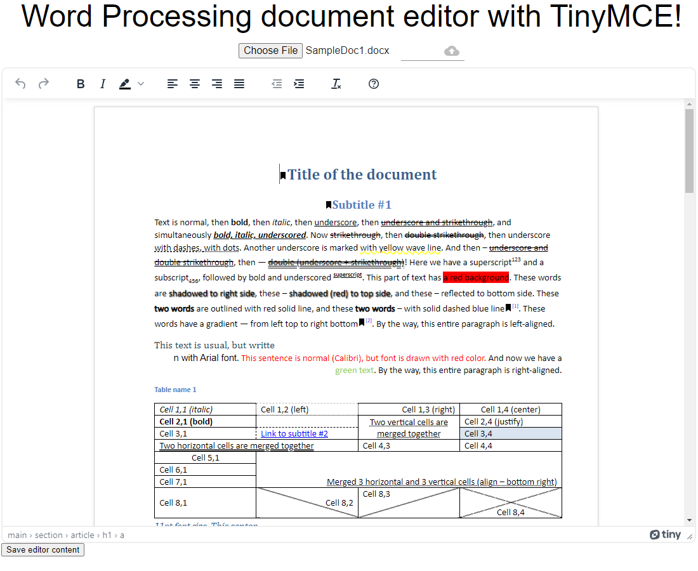

# Building a Document Editing SPA with GroupDocs.Editor.UI.Api and TinyMCE

The **GroupDocs.Editor.UI.ReactSpaSample** demonstrates how to effectively use the **GroupDocs.Editor.UI.Api** together with the **TinyMCE** as a What You See Is What You Get (WYSIWYG) editor. This Single Page Application (SPA) integrates a RESTful API and a user interface built with React, providing a robust solution for document editing. You can explore the configuration details and resources related to this project in the [GroupDocs.Editor.UI.ApiSample](https://github.com/groupdocs-editor/GroupDocs.Editor-for-.NET-UI/tree/master/samples/GroupDocs.Editor.UI.ApiSample) repository.



## Overview

**GroupDocs.Editor.UI.ReactSpaSample** provides a clear example of how to build a web application for document editing using the following technologies:

- **GroupDocs.Editor.UI.Api**: This RESTful API is responsible for serving content, including opening, viewing, editing, and saving Word documents. It is the backbone of the document editing capabilities.

- **TinyMCE**: TinyMCE is a popular WYSIWYG editor that allows users to create, edit, and format content within web applications.

## Getting Started

To get started with this project, follow these steps:

1. **Clone the Repository**: Clone the **GroupDocs.Editor.UI.ReactSpaSample** repository to your local development environment.

2. **Configuration**: Configure the necessary settings by referring to the details provided in the [GroupDocs.Editor.UI.ApiSample](https://github.com/groupdocs-editor/GroupDocs.Editor-for-.NET-UI/tree/master/samples/GroupDocs.Editor.UI.ApiSample) repository. These settings include specifying the licensing type and source for the GroupDocs.Editor for .NET library.

3. **Install Dependencies**: Navigate to the project directory and install the required dependencies using the `npm` or `yarn` package managers:

   ```bash
   npm install
   # OR
   yarn install
   ```

4. **Run the Application**: Start the application to see it in action. You can use the following command to run the project:

   ```bash
   npm start
   # OR
   yarn start
   ```

The application should now be accessible, allowing you to perform document editing with the integrated TinyMCE editor as UI and the **GroupDocs.Editor.UI.Api** as underlying API.

## Features and Functionality

The **GroupDocs.Editor.UI.ReactSpaSample** brings several features and functionalities to the table:

- **Document Editing**: Users can open, view, and edit Word documents in a user-friendly manner using the TinyMCE editor.

- **RESTful API**: The API serves content and provides the necessary endpoints for document editing operations.

- **Configuration**: The application is highly configurable, allowing you to specify licensing and other settings as per your requirements.

## Contributing

Contributions to this project are welcome, and you can actively contribute to its enhancement by adding new features, making improvements, or fixing bugs. When contributing, follow these key steps:

1. Adhere to the code guidelines and conventions.

2. Ensure your pull requests are well-documented, describing the changes you've made and the problems you're addressing.

By following these guidelines, you can help make the **GroupDocs.Editor.UI.ReactSpaSample** an even more powerful and user-friendly solution for document editing.

In conclusion, the **GroupDocs.Editor.UI.ReactSpaSample** is a valuable resource for developers looking to integrate document editing capabilities into their applications using GroupDocs.Editor.UI.Api and TinyMCE. This SPA provides a practical example and a customizable foundation for building feature-rich web applications with document editing functionality.