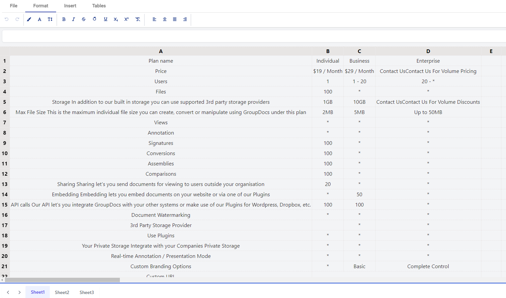

# Building a Document Editing SPA with GroupDocs.Editor.UI.Api and groupdocs.editor.angular.ui-spreadsheet

The **GroupDocs.Editor.UI.ReactSpaSample** demonstrates how to effectively use the **GroupDocs.Editor.UI.Api** in conjunction with the **groupdocs.editor.angular.ui-spreadsheet** as a Document Editor. This Single Page Application (SPA) integrates a RESTful API and an Angular-based user interface, making it a robust solution for document editing. You can explore the configuration details and resources related to this project in the [GroupDocs.Editor.UI.ApiSample](https://github.com/groupdocs-editor/GroupDocs.Editor-for-.NET-UI/tree/master/samples/GroupDocs.Editor.UI.ApiSample) repository.



## Overview

**GroupDocs.Editor.UI.ReactSpaSample** provides a clear example of how to build a web application for document editing using the following technologies:

- **GroupDocs.Editor.UI.Api**: This RESTful API is responsible for serving content, including opening, viewing, editing, and saving spreadsheet documents. It is the backbone of the document editing capabilities.

- **groupdocs.editor.angular.ui-spreadsheet**: This package is used to create a rich, feature-filled Document Editor in the Angular-based user interface.

## Getting Started

To get started with this project, follow these steps:

1. **Clone the Repository**: Clone the **GroupDocs.Editor.UI.ReactSpaSample** repository to your local development environment.

2. **Configuration**: Configure the necessary settings by referring to the details provided in the [GroupDocs.Editor.UI.ApiSample](https://github.com/groupdocs-editor/GroupDocs.Editor-for-.NET-UI/tree/master/samples/GroupDocs.Editor.UI.ApiSample) repository. These settings include specifying the licensing type and source for the GroupDocs.Editor for .NET library.

3. **Install Dependencies**: The Angular part of the application is placed in the `ClientApp\` directory. To start, you need to run the C# project. Navigate to the project directory and run the C# project using your preferred development environment, such as Visual Studio:

   ```bash
   dotnet run
   ```

The application should now be accessible, allowing you to perform document editing with the integrated **groupdocs.editor.angular.ui-spreadsheet** as UI and the **GroupDocs.Editor.UI.Api** as underlying API.

## Features and Functionality

The **GroupDocs.Editor.UI.ReactSpaSample** offers a rich set of features and functionalities:

- **Document Editing**: Users can open, view, and edit spreadsheet documents with the feature-rich groupdocs.editor.angular.ui-spreadsheet Document Editor.

- **RESTful API**: The API serves content and provides the necessary endpoints for document editing operations.

- **Configuration**: The application is highly configurable, allowing you to specify licensing and other settings as per your requirements.

## Contributing

Contributions to this project are welcome, and you can actively contribute to its enhancement by adding new features, making improvements, or fixing bugs. When contributing, follow these key steps:

1. Adhere to the code guidelines and conventions.

2. Ensure your pull requests are well-documented, describing the changes you've made and the problems you're addressing.

By following these guidelines, you can help make the **GroupDocs.Editor.UI.ReactSpaSample** an even more powerful and user-friendly solution for document editing.

In conclusion, the **GroupDocs.Editor.UI.ReactSpaSample** is a valuable resource for developers looking to integrate document editing capabilities into their applications using GroupDocs.Editor.UI.Api and groupdocs.editor.angular.ui-spreadsheet. This SPA provides a practical example and a customizable foundation for building feature-rich web applications with advanced document editing functionality.